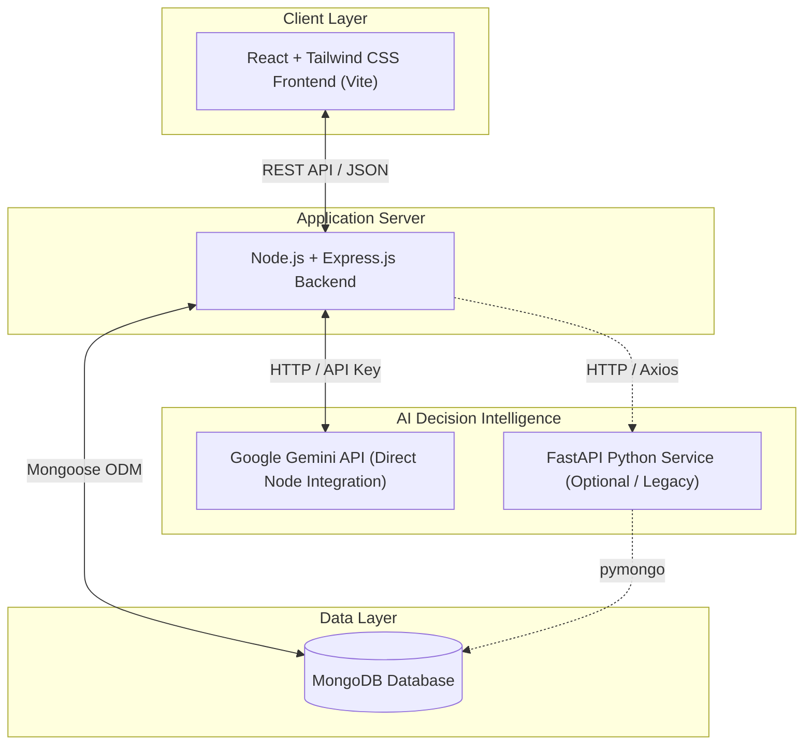

# Smart Inventory & Business Insight System (SIBIS)

SIBIS is a smart, AI-powered web-based Inventory Management and Business Decision Support System designed for small grocery stores, pharmacies, minimarts, and local retail shops. It bridges the gap between traditional record-keeping and modern enterprise resource planning (ERP) by pairing standard POS/inventory workflows with machine learning demand forecasting and contextual AI advisors.

---

## 📌 Project Overview
Many small retail businesses still manage their inventory using physical registers (khata) or static Excel sheets. This approach introduces operational friction and financial leakage, including:
*   **Inability to track low-running stock in real-time**, leading to unexpected stockouts of popular items.
*   **Over-purchasing products**, which ties up scarce working capital.
*   **Losses due to product expiration**, particularly for food and pharmaceuticals.
*   **Difficulty in identifying high-margin versus slow-moving products.**
*   **Relying on guesswork for stock reordering**, rather than historical trends and market variables.

**SIBIS** mitigates these challenges by combining a robust **Inventory Management & POS System** with an **AI-driven Decision Support System (a Smart Assistant)**.

---

## ⚙️ How the System Works (Full Workflow)
1.  **Customer Purchase:** A customer selects products to buy.
2.  **Point of Sale (POS):** The cashier scans or searches products, compiles the basket, and processes the sale.
3.  **Real-time Database Updates:** The sale updates the database via Express, Mongoose decrements inventory counts, writes stock logs, and updates financial charts immediately.
4.  **AI Service Analysis:** The Python FastAPI AI service pulls historical sales patterns and runs predictions.
5.  **Predictive Forecasting:** The system forecasts future product demand and generates recommendations for reorder points.
6.  **Dashboard Insights & Gemini summary:** Reorder recommendations and business trends are processed via Google's Gemini 1.5 Flash API to present a concise daily summary to the store owner.
7.  **AI Chatbot Advisor:** The store owner asks the conversational agent for advice on restocking, weather disruptions, seasonal holidays, or general operations.

---

## 🏗️ System Architecture



---

## 📂 Directory Structure

Here is an overview of the SIBIS workspace:

```
SIBIS/
├── ai/                      # Python FastAPI AI Service
│   ├── src/
│   │   ├── config.py        # Host, Port, and MongoDB configuration
│   │   ├── database.py      # PyMongo connection helper
│   │   ├── forecasting.py   # Scikit-Learn demand forecasting calculations
│   │   ├── insights.py      # Statistical margin, velocity, and stock analysis
│   │   └── main.py          # FastAPI application & server endpoints
│   ├── .env                 # AI service environment configuration
│   └── requirements.txt     # Python service dependencies
│
├── backend/                 # Express.js REST API Server
│   ├── src/
│   │   ├── config/
│   │   │   ├── db.js        # MongoDB connection and auto-seeding script
│   │   │   ├── firebase.js  # Firebase Admin SDK initialization
│   │   │   ├── seed.js      # Basic database seeding utility
│   │   │   └── seed_200_products.js # Dense database mock inventory seeder
│   │   ├── controllers/     # Route business logic handlers
│   │   ├── middleware/      # JWT validation and RBAC checks
│   │   ├── models/          # Mongoose database models
│   │   ├── routes/          # Express API route endpoints
│   │   ├── utils/           # Shared helpers (e.g. activityLogger)
│   │   └── app.js           # Express app setup and middleware routing
│   ├── .env                 # Express server secrets and URIs
│   ├── migrate.js           # Local MongoDB to Atlas migration utility
│   ├── package.json         # Node.js backend dependencies
│   ├── scratch_api_test.js  # Automated offline API route tests
│   └── scratch_test.js      # Offline Mongoose schema checks
│
├── frontend/                # React Vite SPA Application
│   ├── src/
│   │   ├── assets/          # Static icons, logos, and styling images
│   │   ├── components/      # Common components (Layout, Navbar, Sidebar, Chatbot, ThemeSelector)
│   │   ├── config/          # Firebase client-side SDK configuration
│   │   ├── context/         # AuthContext and ThemeContext definitions
│   │   ├── pages/           # 19 core UI views (POS, Dashboard, Products, ReorderList, etc.)
│   │   ├── services/        # Axios API client instances
│   │   ├── App.css          # Core CSS variables
│   │   ├── index.css        # Tailwind CSS configuration and global resets
│   │   └── main.jsx         # App mounting entry point
│   ├── .env                 # Frontend Firebase configurations
│   ├── package.json         # React project dependencies
│   └── vite.config.js       # Vite bundler options
│
├── check_workspace.js       # Workspace validation and build validator script
├── package.json             # Root workspace runner configuration
└── README.md                # System documentation
```

---

## 🛠️ Main Modules & Features

### 1. Authentication & Role-Based Access Control (RBAC)
*   **Supported Roles:** `System Admin`, `Owner`, `Manager`, `Cashier`, `Inventory Staff`.
*   **Access Control:** Middleware guards ensure that only authorized personnel can view financials, modify inventory, authorize purchase orders, or toggle user status.
*   **Security:** Multi-channel security combining JSON Web Tokens (JWT) for API requests and Firebase Authentication for identity assertions.

### 2. Product & Inventory Management
*   **Catalog Control:** Complete CRUD for products including SKU, name, category, brand, supplier, purchase cost, selling price, safety stock threshold, and expiration dates.
*   **Stock Transactions:** Tracks every change in quantity with custom logs to prevent shrinkage and audit stock movement.
*   **Visual Alerts:** Highlights expiring products or items falling below the safety stock threshold directly on the user's dashboard.

### 3. Point of Sale (POS)
*   **Checkout Console:** Responsive checkout terminal with product search, real-time total updates, tax estimates, and profit margin calculation.
*   **Instant Sync:** Completing a sale automatically decrements inventories, records sales metrics, logs user activity, and triggers inventory warnings.

### 4. Purchase & Procurement
*   **Purchase Orders (PO):** Managers can create procurement requests matching low-stock suggestions.
*   **Status Workflows:** Tracks PO states from `Draft` ➔ `Ordered` ➔ `Received`. When marked as `Received`, the backend automatically updates the corresponding product stocks.

### 5. Centralized Business Dashboard
*   **Financial Metrics:** Dynamic displays of Today's Sales, Month-to-Date Revenue, Gross Margin, and product counts.
*   **AI Recommendations Panel:** Highlights restocking priority and custom actions suggested by the AI engine.

### 6. Business Calendar & Logs
*   **Operations Calendar:** Tracks delivery schedules, expiration warnings, and business events.
*   **Activity Ledger:** Audit trail tracking which cashier created a sale, which manager registered stock, and changes to system configuration.

---

## 🤖 Smart AI Decision Support Layer

SIBIS features a unified Artificial Intelligence service powered directly by Google's Gemini API:

### 1. Demand Forecasting & Smart Reorders
*   **Gemini Engine (Primary):** Fits daily product sales historical counts directly using the **Google Gemini 1.5 Flash API** using structured JSON formatting. Gemini analyzes sales velocities and returns predictions contextually.
*   **Local Node.js Fallbacks (Resilient Backup):** If the Gemini API key is missing or calls fail/time out, the system automatically transitions to a local mathematical moving average (calculating average daily sales velocity over the last 30 days to predict demand).
*   **Reordering Rules:** Triggers alerts when:
    $$\text{Current Stock} \le \text{Minimum Threshold} \quad \text{OR} \quad \text{Current Stock} < \text{Predicted 7-day Demand}$$
*   **Recommended Count Calculation:**
    $$\text{Order Qty} = \max\left(\text{Min Threshold}, \lceil \text{Predicted 7-day Demand} - \text{Current Stock} + \text{Min Threshold} \rceil\right)$$

### 2. Executive Business Briefs
*   Extracts raw business alerts (e.g. low stock, high-margin performers, zero-velocity items).
*   Synthesizes details using a structured prompt through the **Gemini 1.5 Flash API** to output a concise, 2-to-3 sentence plain-text daily summary for store owners.

### 3. SIBIS Context-Aware AI Advisor (Chatbot)
The system injects deep contextual layers into the chatbot's system instructions:
*   **Store Context:** Current unique product counts, low stock counts, out-of-stock titles, recent sales statistics.
*   **External Dhaka Market Factors:**
    *   *Weather Patterns:* Accounts for Dhaka monsoon disruptions (heavy rainfall reducing physical traffic by 15-20% but driving up delivery requests) or extreme heatwaves.
    *   *Seasonal Holidays:* Adapts advice based on upcoming local holidays (e.g. Durga Puja, Eid-ul-Fitr semai/meat demands, Victory Day, Independence Day).
    *   *Supply Chain Alerts:* Infuses inflation markers (highway logistic delays, onion/potato price volatility, imported chocolate tariff spikes) into conversation strategies.

---

## 🔑 Default Credentials (Auto-Seeded)

Upon initial database connection, the server seeds a default store (**Apex Supermarket**, Code: `STR-APEX-101`) and the following accounts to get you started quickly:

| Role | Email | Password | Description |
| :--- | :--- | :--- | :--- |
| **System Admin** | `admin@sibis.com` | `admin123` | Can toggle store statuses, view platform metrics. |
| **Owner** | `owner@sibis.com` | `password123` | Full access to Apex Supermarket, financials, staff, POS. |
| **Manager** | `manager@sibis.com` | `password123` | Full store administration and PO approval permissions. |
| **Cashier** | `cashier@sibis.com` | `password123` | Access restricted to the POS checkout interface. |
| **Inventory Staff** | `inventory@sibis.com` | `password123` | Access to product management and inventory counts. |

---

## 💻 Tech Stack

### Client (Frontend)
*   **React.js (v19)**: Single-page application framework.
*   **Vite**: Frontend build system.
*   **Tailwind CSS (v4)**: Modern utility-first styling context.
*   **React Router Dom (v7)**: Navigation routing.
*   **Lucide React**: Icon library.
*   **Firebase Web SDK**: Identity services.

### Application Server (Backend)
*   **Node.js & Express.js**: REST API application server.
*   **Mongoose ODM**: Object-document mapper for MongoDB.
*   **JSON Web Tokens (JWT)**: Secure user session validation.
*   **Firebase Admin SDK**: Verification of tokens for single sign-on.
*   **Morgan & Helmet**: Security headers and request logging.

### AI Decision Service
*   **Python (3.9+) & FastAPI**: Analytics routing endpoint.
*   **Scikit-Learn**: Machine learning regression models.
*   **Pandas & NumPy**: Data processing and statistical analysis.
*   **Google Gemini API**: Large language model integration.

---

## 🚀 Setup & Installation

### Prerequisites
*   **Node.js** (v18+)
*   **Python** (v3.9+)
*   **MongoDB** (Running locally, or a MongoDB Atlas connection string)
*   **Google Gemini API Key** (Get one from [Google AI Studio](https://aistudio.google.com/))

---

### Step 1: Backend Setup
1.  Navigate to the backend directory:
    ```bash
    cd backend
    ```
2.  Install required dependencies:
    ```bash
    npm install
    ```
3.  Create your local environment file:
    ```bash
    cp .env.example .env
    ```
4.  Configure the `.env` variables:
    ```env
    PORT=5000
    MONGO_URI=mongodb://localhost:27017/sibis
    NODE_ENV=development
    JWT_SECRET=super-secret-key-change-in-production
    JWT_EXPIRES_IN=30d
    AI_SERVICE_URL=http://localhost:8000
    GEMINI_API_KEY=your_gemini_api_key
    ```
5.  Start the development server:
    ```bash
    npm run dev
    ```

---

### Step 2: Python AI Service Setup (Optional / Legacy)

> [!NOTE]  
> This step is optional. By default, SIBIS now performs demand forecasting directly via the Google Gemini API from the Node.js backend. You only need to run this if you want to use the legacy Scikit-Learn local regression microservice.

1.  Navigate to the AI directory:
    ```bash
    cd ../ai
    ```
2.  Create and activate a Python virtual environment:
    ```bash
    python -m venv .venv
    # Windows:
    .venv\Scripts\activate
    # macOS/Linux:
    source .venv/bin/activate
    ```
3.  Install dependencies:
    ```bash
    pip install -r requirements.txt
    ```
4.  Configure the `.env` file inside `ai/`:
    ```env
    PORT=8000
    MONGO_URI=mongodb://localhost:27017/sibis
    HOST=127.0.0.1
    ```
5.  Launch the FastAPI server:
    ```bash
    python src/main.py
    ```

---

### Step 3: Frontend Setup
1.  Navigate to the frontend directory:
    ```bash
    cd ../frontend
    ```
2.  Install dependencies:
    ```bash
    npm install
    ```
3.  Create the frontend `.env` file using your Firebase app configurations:
    ```env
    VITE_FIREBASE_API_KEY=your_api_key
    VITE_FIREBASE_AUTH_DOMAIN=your_auth_domain
    VITE_FIREBASE_PROJECT_ID=your_project_id
    VITE_FIREBASE_STORAGE_BUCKET=your_storage_bucket
    VITE_FIREBASE_MESSAGING_SENDER_ID=your_sender_id
    VITE_FIREBASE_APP_ID=your_app_id
    VITE_FIREBASE_MEASUREMENT_ID=your_measurement_id
    VITE_API_URL=http://localhost:5000/api
    ```
4.  Start the development server:
    ```bash
    npm run dev
    ```

---

### Step 4: Running the Entire Workspace Concurrently
To run all three layers (Backend, AI Service, Frontend) together with a single terminal command:
1.  Navigate to the project root directory.
2.  Install development dependencies:
    ```bash
    npm install
    ```
3.  Run the development script:
    ```bash
    npm run dev
    ```

---

## 🌐 Production Deployment

For production deployments, the system configuration shifts from local loopback (`localhost`) ports to live remote hosting URLs. SIBIS is designed to run seamlessly in the cloud with the following structure:

### 1. Database (MongoDB Atlas)
*   Deploy a cluster on [MongoDB Atlas](https://www.mongodb.com/cloud/atlas).
*   Obtain your connection string (e.g. `mongodb+srv://<username>:<password>@cluster0.xxxx.mongodb.net/sibis`).
*   Ensure the Network Access rules in MongoDB Atlas allow the IP address of your backend host (Render) or allow connections from anywhere (`0.0.0.0/0`).

### 2. Backend API Service (Render)
*   Deploy the `backend` folder as a **Web Service** on [Render](https://render.com/).
*   **Root Directory**: `backend`
*   **Build Command**: `npm install`
*   **Start Command**: `npm start`
*   Configure the following **Environment Variables** in Render's dashboard settings:
    *   `NODE_ENV=production`
    *   `MONGO_URI=mongodb+srv://<username>:<password>@cluster0.xxxx.mongodb.net/sibis` (Your Atlas URI)
    *   `JWT_SECRET=your_long_secure_production_secret`
    *   `JWT_EXPIRES_IN=30d`
    *   `AI_SERVICE_URL=https://your-ai-service.onrender.com` *(The deployed URL of your FastAPI AI service, see below)*
    *   `GEMINI_API_KEY=your_gemini_api_key_from_google_ai_studio`

> [!IMPORTANT]  
> Since the backend runs in Render, setting `AI_SERVICE_URL` to `http://localhost:8000` will fail, as `localhost` inside Render points to the backend container itself, not the Python AI service. You **must** update this value to point to the live FastAPI URL.

### 3. AI Service (Render or equivalent)
*   Deploy the `ai` folder as a **Web Service** on Render.
*   **Root Directory**: `ai`
*   **Build Command**: `pip install -r requirements.txt`
*   **Start Command**: `uvicorn src.main:app --host 0.0.0.0 --port $PORT`
*   Configure the following **Environment Variables**:
    *   `PORT=10000` (Render will allocate this automatically)
    *   `HOST=0.0.0.0`
    *   `MONGO_URI=mongodb+srv://<username>:<password>@cluster0.xxxx.mongodb.net/sibis` *(Point to the same MongoDB Atlas database as the backend so that the regression models run on real live data)*

### 4. Client Application (Netlify)
*   Deploy the `frontend` folder to [Netlify](https://www.netlify.com/).
*   **Base Directory**: `frontend`
*   **Build Command**: `npm run build`
*   **Publish Directory**: `frontend/dist`
*   Configure the following **Environment Variables** in the Netlify site settings:
    *   `VITE_API_URL=https://your-backend-api.onrender.com/api` *(Your deployed Render backend URL)*
    *   `VITE_FIREBASE_API_KEY` ... (and all other Firebase configuration variables from your `.env` file)

---

## ⚡ Developer Scripts & Utilities

### Workspace Health Check
SIBIS features an automated validation suite to check file integrity, Mongoose connections, REST routing, and frontend compilation:
```bash
node check_workspace.js
```
This runs:
*   Mongoose offline validations (`backend/scratch_test.js`)
*   API integration checks (`backend/scratch_api_test.js`)
*   Vite build tests in the frontend folder.

### Database Migration
If you need to push your local database contents to a remote MongoDB Atlas database, SIBIS provides a collection-by-collection copier:
```bash
cd backend
node migrate.js "mongodb+srv://<username>:<password>@cluster0.xxxxxx.mongodb.net/sibis"
```

---

## 🔗 REST API Endpoint Reference

### Users & Authentication (`/api/users`)
*   `POST /api/users/register` - Register a user.
*   `POST /api/users/register-store` - Create a new store layout.
*   `POST /api/users/login` - Authenticate local credentials.
*   `POST /api/users/google-auth` - Authenticate with Google identity.
*   `POST /api/users/send-verification-otp` - Dispatch OTP for security checks.
*   `POST /api/users/verify-otp` - Validate user verification OTP.
*   `GET /api/users/profile` - Fetch current user profile details.
*   `PUT /api/users/profile` - Update profile particulars.
*   `GET /api/users/store-profile` - Retrieve store registration data.
*   `PUT /api/users/store-profile` - Modify store configurations.
*   `GET /api/users/activity` - Fetch store activity logging records (restricted access).
*   `GET /api/users/store-calendar-events` - Get inventory and purchase calendar events.
*   `GET /api/users/staff` - Get store staff listings.
*   `POST /api/users/staff` - Add a staff member.
*   `PUT /api/users/staff/:id/status` - Toggle a staff status (Active/Suspended).
*   `DELETE /api/users/staff/:id` - Remove a staff user.

### Product Catalog (`/api/products`)
*   `GET /api/products` - List store inventory.
*   `POST /api/products` - Add new catalog product (restricted).
*   `GET /api/products/low-stock` - Get inventory below warning threshold.
*   `GET /api/products/expiring` - List items expiring soon.
*   `GET /api/products/inventory-history` - Stock adjustment audit logging.
*   `GET /api/products/:id` - Product profile details.
*   `PUT /api/products/:id` - Edit product specifications.
*   `DELETE /api/products/:id` - Delete product.

### Sales & Point of Sale (`/api/sales`)
*   `POST /api/sales` - Submit a new sale checkout transaction.
*   `GET /api/sales` - Review invoice log history.
*   `GET /api/sales/:id` - Retrieve unique invoice record.

### Procurement & Purchase Orders (`/api/purchase-orders`)
*   `GET /api/purchase-orders` - List purchase orders.
*   `POST /api/purchase-orders` - Formulate new PO.
*   `GET /api/purchase-orders/:id` - Purchase order overview.
*   `PUT /api/purchase-orders/:id/status` - Update PO status (`Draft` ➔ `Ordered` ➔ `Received`).

### Supplier Directories (`/api/suppliers`)
*   `GET /api/suppliers` - List linked store suppliers.
*   `POST /api/suppliers` - Register new wholesale partner.
*   `GET /api/suppliers/:id` - Get supplier details.
*   `PUT /api/suppliers/:id` - Edit supplier contact details.
*   `DELETE /api/suppliers/:id` - Remove supplier.

### AI Decision Operations (`/api/ai`)
*   `GET /api/ai/recommendations` - Run predictive forecasting and get reorder suggestions.
*   `GET /api/ai/insights` - Get statistical insights and daily executive summaries.
*   `POST /api/ai/chat` - Interact contextually with the SIBIS chatbot.

### System Administration (`/api/admin`)
*   `GET /api/admin/stores` - View registered SIBIS stores.
*   `POST /api/admin/stores` - Manually register a store environment.
*   `PUT /api/admin/stores/:id/status` - Toggle store operation status (Active/Suspended).
*   `GET /api/admin/stats` - Platform health charts.
