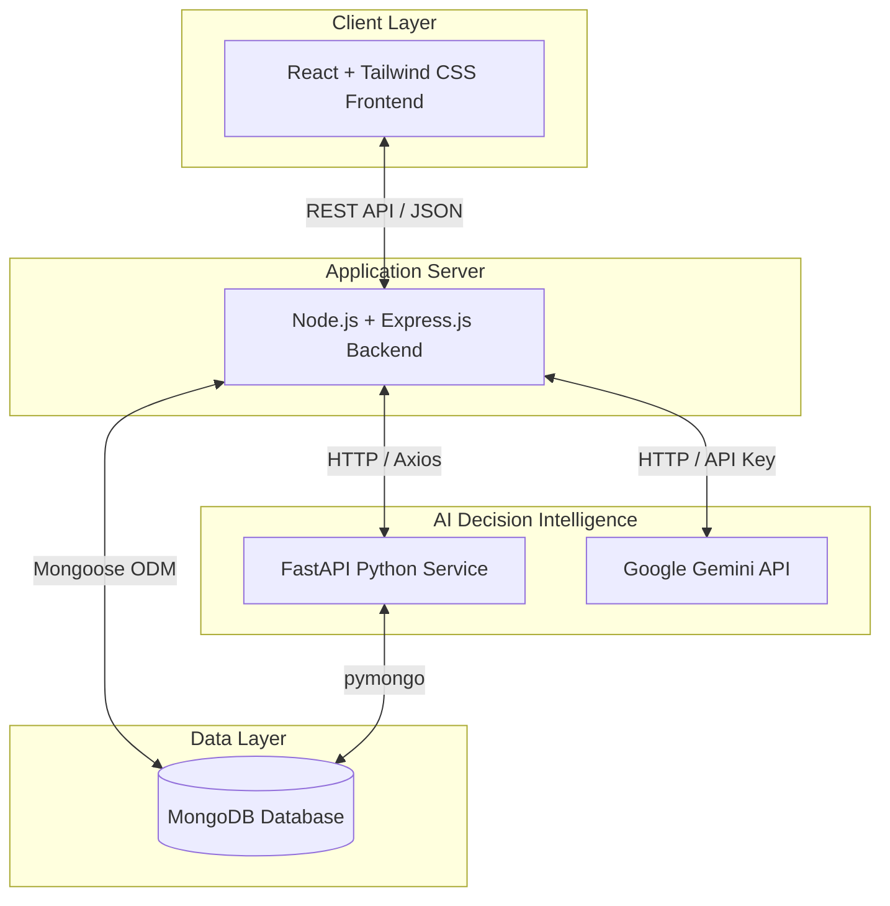

# Smart Inventory & Business Inventory System (SIBIS)

A smart, AI-powered web-based Inventory Management and Business Decision Support System designed for small grocery stores, pharmacies, minimarts, and local retail shops.

---

## 📌 Project Overview
Many small retail businesses still manage their inventory using registers (khata) or Excel sheets. This approach leads to several challenges:
*   Inability to track low-running stock in real-time.
*   Over-purchasing products, tying up working capital.
*   Losses due to product expiration.
*   Difficulty in identifying high-performing and low-performing products.
*   Relying on guesswork for stock reordering.

**SIBIS** addresses these challenges by combining a standard Inventory Management System with an AI-driven Decision Support System (a Smart Assistant).

---

## ⚙️ How the System Works (Full Workflow)
1.  **Customer Purchase:** A customer selects products to buy.
2.  **Point of Sale (POS):** The cashier completes the sale using the POS module.
3.  **Real-time Updates:** The sale is saved to the Sales Database, stock levels are automatically reduced, and sales history is updated. No manual stock adjustments are needed.
4.  **AI Analysis:** At scheduled intervals, the AI service analyzes the sales data.
5.  **Predictive Forecasting:** The AI forecasts future demand and creates smart reorder recommendations.
6.  **Dashboard Insights:** Reorder recommendations and business insights are displayed on the Owner's Dashboard.

---

## 🏗️ System Architecture



---

## 🛠️ Main Modules

### 1. Authentication & Role-Based Access Control (RBAC)
*   **Roles:** Owner, Manager, Cashier, Inventory Staff.
*   **Permissions:** Custom dashboard views and features mapped to specific user roles to ensure security and division of labor.

### 2. Product & Inventory Management
*   Add, edit, and delete products.
*   Manage Categories, Brands, and Suppliers.
*   Track current stock levels, purchase prices, and selling prices.
*   Track Stock-In and Stock-Out operations with full logs.

### 3. Sales (Point of Sale - POS)
*   Product search and scanning.
*   Cart creation and management.
*   Invoice/Receipt generation.
*   Payment processing and real-time stock decrement.

### 4. Purchase Management
*   Create Purchase Orders (PO).
*   Select suppliers and manage procurement.
*   Automatically update stock levels when items are received.

### 5. Supplier Management
*   Maintain supplier details (Name, contact info, address).
*   Track purchase history per supplier.

### 6. Business Dashboard
A central hub for store owners to view the pulse of their business at a glance:
*   Today's Sales & Monthly Revenue.
*   Total Product Counts.
*   Alerts for Low Stock & Expiring Products.
*   Top Selling Products.
*   **AI Recommendations & Insights Panel** with automatic summary generation.

---

## 🤖 Smart AI Features

*   **AI Feature 1 — Demand Forecasting:** Analyzes historical sales data using standard linear regression models to predict future demand over the next 7 days.
*   **AI Feature 2 — Smart Reorder Recommendations:** Combines current stock levels with demand forecasts to recommend exact order quantities.
*   **AI Feature 3 — Executive Business Brief (Google Gemini):** Condenses raw data alerts (low stock, highest profit margin, slow-moving items) into a professional, daily summary for the store owner.
*   **AI Feature 4 — SIBIS AI Advisor (ChatBot):** A live conversational advisor powered by the Gemini API that answers questions contextually using real-time store statistics.

---

## 💻 Tech Stack

### Frontend
*   **Framework:** React.js (Vite + Tailind CSS)
*   **Icons:** Lucide React

### Backend
*   **Framework:** Node.js + Express.js
*   **Database:** MongoDB (via Mongoose ODM)
*   **Authentication:** Firebase Auth

### AI Service
*   **Language & API:** Python + FastAPI
*   **Data Analysis & ML:** Scikit-learn, Pandas

---

## 🚀 Setup & Installation

### Prerequisites
*   Node.js (v18+)
*   Python (3.9+)
*   MongoDB (Running locally or MongoDB Atlas)
*   Google Gemini API Key

### 1. Backend Setup
1. Navigate to the `backend` folder:
   ```bash
   cd backend
   ```
2. Install dependencies:
   ```bash
   npm install
   ```
3. Create a `.env` file from the example:
   ```bash
   cp .env.example .env
   ```
4. Set up your environment variables:
   ```env
   PORT=5000
   MONGO_URI=mongodb://localhost:27017/sibis
   JWT_SECRET=your_jwt_secret
   AI_SERVICE_URL=http://localhost:8000
   GEMINI_API_KEY=your_gemini_api_key
   ```
5. Start the backend:
   ```bash
   npm start
   ```

### 2. Frontend Setup
1. Navigate to the `frontend` folder:
   ```bash
   cd ../frontend
   ```
2. Install dependencies:
   ```bash
   npm install
   ```
3. Start the Vite development server:
   ```bash
   npm run dev
   ```

### 3. Python AI Service Setup
1. Navigate to the `ai` folder:
   ```bash
   cd ../ai
   ```
2. Create and activate a virtual environment:
   ```bash
   python -m venv .venv
   # On Windows:
   .venv\Scripts\activate
   # On macOS/Linux:
   source .venv/bin/activate
   ```
3. Install dependencies:
   ```bash
   pip install -r requirements.txt
   ```
4. Start the FastAPI server:
   ```bash
   python src/main.py
   ```

